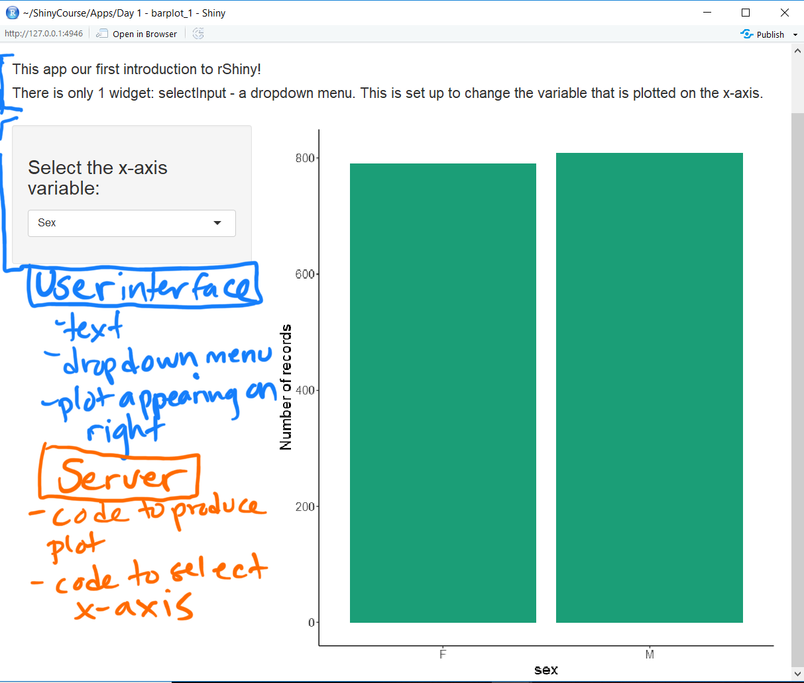

```{r, echo=FALSE, results='hide', message=FALSE, warning=FALSE}
#webshot::install_phantomjs()

library(dplyr)
library(ggplot2)
library(lubridate)
library(leaflet)
library(rgdal)
library(kableExtra)
library(shiny)
library(png)
library(RColorBrewer)

# Load data
raw_data <- read.csv("data/raw_data.csv", stringsAsFactors = FALSE)
region_shp <- readOGR("data/TZ_Region_2012", "TZ_Region_2012")

# Create a colour palette
#col_palette <- c("#231D51", "#178B8B", "#63C963", "#FFE31D") # 2:"#3E507F",
col_palette <- brewer.pal(name="Dark2", n=8)
```

```{r setup, include=FALSE}
knitr::opts_chunk$set(echo = FALSE)
```

<style>
div.footnotes {
position: absolute;
bottom: 0;
margin-bottom: 10px;
width: 80%;
font-size: 0.6em;
}
.bold {color: #4E23B8;}
</style>

<script src="https://ajax.googleapis.com/ajax/libs/jquery/3.1.1/jquery.min.js"></script>
<script>
$(document).ready(function() {
$('slide:not(.backdrop):not(.title-slide)').append('<div class=\"footnotes\">');

$('footnote').each(function(index) {
var text  = $(this).html();
var fnNum = (index+1).toString();
$(this).html(fnNum.sup());

var footnote   = fnNum + '. ' + text + '<br/>';
var oldContent = $(this).parents('slide').children('div.footnotes').html();
var newContent = oldContent + footnote;
$(this).parents('slide').children('div.footnotes').html(newContent);
});
});
</script>

<!----------------------------------------------------------------------------->
## Course Overview {.smaller}

<h3><b>Day 1:</b></h3>
<ul>
<li> 1.1 Getting to know your data </li>
<li> 1.2 Data subsetting and summarising </li>
<li> 1.3 Build exploratory plots </li>
<li> <b class="bold"> 1.4 Build an interactive plot in RShiny </b></li>
</ul>

<h3><b>Day 2:</b></h3>
<ul>
<li> 2.1 Introduction to leaflet </li>
<li> 2.2 Building a leaflet map in R </li>
<li> 2.3 Build an interactive map in RShiny </li>
</ul>

<h3><b>Day 3:</b></h3>
<ul>
<li> 3.1 Review </li>
<li> 3.2 Build your own apps! </li>
</ul>

<!----------------------------------------------------------------------------->
## Build an interactive plot in RShiny  

A shiny app is normally built with 2 sections:  

- The <b>ui</b> (user interface) contains code for the part of the app that the user sees.  
- The <b>server</b> contains code for the processing behind the user interface.

These can be contained in one R script, or multiple R scripts saved in the same folder. 

  - The 2 methods are very similar
  - Can be easier to separate your code and sections using the 'multiple file' layout.  

**All our examples and practice sections will use seperate <b>server.R</b> and <b>ui.R</b> files.


<!----------------------------------------------------------------------------->
## Your turn - complete section 1.4a

  <center></center>

<!----------------------------------------------------------------------------->
## Your turn - Results section 1.4a  

<!----------------------------------------------------------------------------->
## Inputs  

- To make the app interactive, you need an input that the user can change  
- Shiny includes a selection of functions for this called <b>widgets</b>:  

``` {r, echo=FALSE}
widgets <- data.frame(Name=c("``actionButton()``", "``checkboxInput()``", "``checkboxGroupInput()``",
                             "``dateInput()``", "``dateRangeInput()``", "``numericInput()``", "``radioButtons()``",
                             "``selectInput()``", "``sliderInput()``", "``textInput()``"),
                      Description=c("a button click input", "a single checkbox",
                                    "a set of checkboxes where multiple can be selected", 
                                    "a calendar for date selection",
                                    "a pair of calendars for start and end date selection",
                                    "a free-text for numbers", "a set of buttons where only 1 can be selected",
                                    "a dropdown menu", "a slider bar", "a free-text for letters/words"))
kable_styling(kable(widgets), font_size=16)
```

<!----------------------------------------------------------------------------->
## Outputs  

- An output is required to show the user the effects of their input  
- ``render()`` functions are used in the <b>server</b>, saved to an object as ``output$___``  
- ``output()`` functions are used in the <b>ui</b>

``` {r, echo=FALSE}
outputs <- data.frame("render"=c("``renderImage()``", "``renderPlot()``", "``renderPrint()``",
                                 "``renderTable()``", "``DT::renderDataTable()``", "``renderText()``", 
                                 "``rendeerUI()``"),
                      "output"=c("``imageOutput()``", "``plotOutput()``", "``verbatimTextOutput()``",
                                 "``tableOutput()``", "``dataTableOutput()``", 
                                 "``textOutput()``", "``uiOutput()`` or ``htmlOutput()``"))
kable_styling(kable(outputs), font_size=16)
```

<!----------------------------------------------------------------------------->
## Using inputs and outputs together

<b>ui</b>
```{r, echo=TRUE, eval=FALSE}
# Input
radioButtons(inputId = "radio", label = "Choose a number:", selected = 1, 
             choices = list("Choice 1" = 1, "Choice 2" = 2, "Choice 3" = 3)) 

# Output
verbatimTextOutput("chosen_number")
```

<b>server</b>
```{r, echo=TRUE, eval=FALSE}
# Render
output$chosen_number <- renderPrint({
  input$radio 
})
```

<!----------------------------------------------------------------------------->
## Using inputs and outputs together

<br>

```{r, echo=FALSE}
shinyApp(
  
  ui = fluidPage(
    tags$head(
      tags$style(HTML("
      #txt {font-size: 26px;}
      #txt b {font-family: 'Lucida Console', Monospace; color: #5bb662; font-size: 26px; font-weight: normal;}
    "))),
    
    HTML("<div id='txt'>Input: <b>radioButtons()</b></div>"),
    radioButtons(inputId="radio", label="Choose a number:", selected=1, 
                 choices=list("Choice 1"=1, "Choice 2"=2, "Choice 3"=3)), 
    
    br(),
    
    HTML("<div id='txt'>Input: <b>textOutput()</b></div>"),
    verbatimTextOutput("chosen_number")
  ),
  
  server = function(input, output) {
    output$chosen_number <- renderPrint({
      input$radio 
    })
  },
  
  options = list(height = 500)
)
```

<!----------------------------------------------------------------------------->
## Your turn  

Read the <em>App Guide</em> of the handout, then complete section 1.4b.  

<!----------------------------------------------------------------------------->
## Your turn - Results section 1.4b {.smaller}

<b>ui</b>
```{r, echo=TRUE, eval=FALSE}
# SIDE PANEL
selectInput("xaxis", label = h3("Select the x-axis variable:"),
            choices = list("Sex" = "sex", "Species" = "species", "Age" = "age"),
            selected = 1)

# MAIN PANEL
plotOutput("barPlot", height=700)
```

<b>server</b>
```{r, echo=TRUE, eval=FALSE}
output$barPlot <- renderPlot({
  ggplot() +
    geom_bar(data=raw_data, aes(x=raw_data[[input$xaxis]]), fill=col_palette[1]) +
    labs(x=paste0("\n", input$xaxis), y="Number of records\n") +
    theme_classic() +
    theme(axis.text = element_text(size=14),
          axis.title = element_text(size=18),
          plot.title = element_text(size=20),
          legend.title = element_text(size=18),
          legend.text = element_text(size=14))
})
```

<!----------------------------------------------------------------------------->
## Your turn - Results section 1.4b

```{r, echo=FALSE}
shinyApp(
  
  ui = fluidPage(
    tags$head(
      tags$style(HTML("
      #txt {font-size: 26px;}
      #txt b {font-family: 'Lucida Console', Monospace; color: #5bb662; font-size: 26px; font-weight: normal;}
    "))),
    sidebarLayout(
      sidebarPanel(
        selectInput("xaxis", label = h3("Select the x-axis variable:"),
                    choices = list("Sex" = "sex", "Species" = "species", "Age" = "age"),
                    selected = 1)
      ),
      mainPanel(
        plotOutput("barPlot", height=400)
      )
    )
  ),
  
  server = function(input, output) {
    output$barPlot <- renderPlot({
      ggplot() +
        geom_bar(data=raw_data, aes(x=raw_data[[input$xaxis]]), fill=col_palette[1]) +
        labs(x=paste0("\n", input$xaxis), y="Number of records\n") +
        theme_classic() +
        theme(axis.text = element_text(size=14),
              axis.title = element_text(size=18),
              plot.title = element_text(size=20),
              legend.title = element_text(size=18),
              legend.text = element_text(size=14))
    })
  }
)
```

<!----------------------------------------------------------------------------->
## Your turn  

Complete section 1.4c of the handout.  

<!----------------------------------------------------------------------------->
## Your turn - Results section 1.4c {.smaller}

<b>ui</b>
```{r, echo=TRUE, eval=FALSE}
# SIDE PANEL
selectInput("xaxis", label = h3("Select the x-axis variable:"),
            choices = list("Sex" = "sex", "Species" = "species", "Age" = "age"),
            selected = 1)
verbatimTextOutput("output_text"),
verbatimTextOutput("output_values")

# MAIN PANEL
plotOutput("barPlot", height=700)
```

<b>server</b>
```{r, echo=TRUE, eval=FALSE}
output$barPlot <- renderPlot({
  ggplot() +
    geom_bar(data=raw_data, aes(x=raw_data[[input$xaxis]]), fill=col_palette[1]) +
    labs(x=paste0("\n", input$xaxis), y="Number of records\n") +
    theme_classic() +
    theme(axis.text = element_text(size=14),
          axis.title = element_text(size=18),
          plot.title = element_text(size=20),
          legend.title = element_text(size=18),
          legend.text = element_text(size=14))
})
```

<!----------------------------------------------------------------------------->
## Your turn - Results section 1.4c

```{r, echo=FALSE}
shinyApp(
  
  ui = fluidPage(
    tags$head(
      tags$style(HTML("
      #txt {font-size: 26px;}
      #txt b {font-family: 'Lucida Console', Monospace; color: #5bb662; font-size: 26px; font-weight: normal;}
    "))),
    sidebarLayout(
      sidebarPanel(
        selectInput("xaxis", label = h3("Select the x-axis variable:"),
                    choices = list("Sex" = "sex", "Species" = "species", "Age" = "age"),
                    selected = 1),
        br(),
        verbatimTextOutput("output_text"),
        br(),
        verbatimTextOutput("output_values")
      ),
      mainPanel(
        plotOutput("barPlot", height=400)
      )
    )
  ),
  
  server = function(input, output) {
    output$barPlot <- renderPlot({
      ggplot() +
        geom_bar(data=raw_data, aes(x=raw_data[[input$xaxis]]), fill=col_palette[1]) +
        labs(x=paste0("\n", input$xaxis), y="Number of records\n") +
        theme_classic() +
        theme(axis.text = element_text(size=14),
              axis.title = element_text(size=18),
              plot.title = element_text(size=20),
              legend.title = element_text(size=18),
              legend.text = element_text(size=14))
    })
    output$output_text <- renderPrint({
      paste0("You have chosen to show '", input$xaxis, "' on the x-axis.")
    })
    output$output_values <- renderPrint({
      summary(raw_data[[input$xaxis]])
    })
  }
)
```

<!----------------------------------------------------------------------------->
## Making your code 'reactive'  

- All code within the server must be contained within a **reactive** element, otherwise the app will fail to run.  

- The previous examples take the user input and either output it directly or carry out minor processing inside the ``render()`` functions.  

- If we want to subset the data based on user input that can be available to *multiple outputs*, we need to use additional **reactive** functions...

<!----------------------------------------------------------------------------->
## The ``reactive()`` function

- The ``reactive()`` function is used to carry out data processing in response to a user input, with the output saved as an object  

- Objects created in the function should be done with an ``=``, NOT ``<-``  

- The last line of the function should be the object you would like to be saved overall (e.g. a data subset)  

- The final object must be referenced within a ``render()`` function followed by a set of brackets in order to be used  

<!----------------------------------------------------------------------------->
## The ``reactive()`` function {.smaller}

<b>ui</b>
```{r, echo=TRUE, eval=FALSE}
radioButtons(inputId = "radio", label = "Choose a number:", selected = 1, 
             choices = list("Choice 1"=1, "Choice 2"=2, "Choice 3"=3)), 

verbatimTextOutput("chosen_letter")
```

<b>server</b>
```{r, echo=TRUE, eval=FALSE}
n_to_l <- reactive({
  if(input$radio == 1){
    n_letter = "a"
  } else if(input$radio == 2){
    n_letter = "b"
  } else if(input$radio == 3){
    n_letter = "c"
  }
  n_letter
})

output$chosen_letter <- renderPrint({
  n_to_l()
})
```

<!----------------------------------------------------------------------------->
## The ``reactive()`` function

```{r, echo=FALSE}
shinyApp(
  
  ui = fluidPage(
    tags$head(
      tags$style(HTML("
      #txt {font-size: 26px;}
      #txt b {font-family: 'Lucida Console', Monospace; color: #5bb662; font-size: 26px; font-weight: normal;}
    "))),
    
    HTML("<div id='txt'>Input: <b>radioButtons()</b></div>"),
    radioButtons(inputId = "radio", label = "Choose a number:",
                 choices = list("Choice 1"=1, "Choice 2"=2, "Choice 3"=3), 
                 selected = 1), 
    
    br(),
    
    HTML("<div id='txt'>Input: <b>textOutput()</b></div>"),
    verbatimTextOutput("chosen_letter")
  ),
  
  server = function(input, output) {
    n_to_l <- reactive({
      if(input$radio == 1){
        n_letter = "a"
      } else if(input$radio == 2){
        n_letter = "b"
      } else if(input$radio == 3){
        n_letter = "c"
      }
      n_letter
    })
    
    output$chosen_letter <- renderPrint({
      n_to_l()
    })
  },
  
  options = list(height = 500)
)
```

<!----------------------------------------------------------------------------->
## Your turn  

Complete section 1.4d of the handout.  

<div style="color: #FF6666;"> Notes for linking:  

- Change the dropdown from ``species`` to ``region``  
- apps/Day 1 - timeseries_1  
</div>

<!----------------------------------------------------------------------------->
## Your turn - Results section 1.4d  


<!----------------------------------------------------------------------------->
## Your turn  

Complete section 1.4e of the handout.  

<div style="color: #FF6666;"> Notes for linking:  

- Change the checkboxes from ``sex`` to ``species``  
- apps/Day 1 - timeseries_2
</div>

<!----------------------------------------------------------------------------->
## Your turn - Results section 1.4e  

<!----------------------------------------------------------------------------->
## Your turn  

Complete section 1.4f of the handout.  

<div style="color: #FF6666;"> Notes for linking:  

- Change from a 1-sided to a 2-sided slider <em>(remind about ?sliderInput help page)</em>  
- apps/Day 1 - timeseries_3
</div>

<!----------------------------------------------------------------------------->
## Your turn - Results section 1.4f    

<!----------------------------------------------------------------------------->
## The ``reactiveValues()`` function

- ``reactiveValues`` produce an object that acts like a list: you can store multiple values or objects to <em>slots</em>, that are referenced with the ``$`` symbol.  
- The created ``reactiveValues`` object can be created with values, or values can be added after creation:  
```{r, eval=FALSE, echo=TRUE}
# Create reactiveValues object with 2 slots (x and y)
rv <- reactiveValues(x = 34, y <- "This is a shiny Workshop!")

# Add a dataframe to the reactiveValues object in a new slot
rv$z <- data.frame(n = c(1, 2, 3), t = c("a", "b", "c"))
```

- These stored values are updated by reactive functions.  
- This is helpful to display a default dataset that the user can update, particularly if you want a process to be triggered by a specific user event...

<!----------------------------------------------------------------------------->
## The ``observeEvent()`` function

- ``observeEvent`` watches for a specific user input, then runs a section of code  
- The input can be any of the widgets in your app, but works well with ``actionButton()``

<!----------------------------------------------------------------------------->
##  ``reactiveValues()`` & ``observeEvent()`` functions working together

<b>ui</b>
```{r, echo=TRUE, eval=FALSE}
actionButton(inputId="go_button", label="Click to generate a random number:")

verbatimTextOutput("random_number")
```

<b>server</b>
```{r, echo=TRUE, eval=FALSE}
rn <- reactiveValues(n = NA)

observeEvent(input$go_button, {
  rn$n = sample(x = 1:100, size = 1)
})

output$random_number <- renderPrint({
  print(rn$n) 
})
```

<!----------------------------------------------------------------------------->
## ``reactiveValues()`` & ``observeEvent()`` functions working together

```{r, echo=FALSE}
shinyApp(
  
  ui = fluidPage(
    tags$head(
      tags$style(HTML("
      #txt {font-size: 26px;}
      #txt b {font-family: 'Lucida Console', Monospace; color: #5bb662; font-size: 26px; font-weight: normal;}
    "))),
    
    HTML("<div id='txt'>Input: <b>actionButton()</b></div>"),
    actionButton(inputId="go_button", label="Click to generate a random number:"), 
    
    br(), br(),
    
    HTML("<div id='txt'>Input: <b>textOutput()</b></div>"),
    verbatimTextOutput("random_number")
  ),
  
  server = function(input, output) {
    rn <- reactiveValues(n=NA)
    
    observeEvent(input$go_button, {
      rn$n = sample(x=1:100, size=1)
    })
    
    output$random_number <- renderPrint({
      print(rn$n) 
    })
  },
  
  options = list(height = 500)
)
```

<!----------------------------------------------------------------------------->
## Your turn  

Complete section 1.4g of the handout. 

<div style="color: #FF6666;"> Notes:  

- Have a look at the 4th time series plot.  
- What reactive elements have changed in the server code and the ui code?  
- Can you think of any scenarios where it would be helpful to use a "Go" button to trigger a reactive event?  
- apps/Day 1 - timeseries_4
</div>

<!----------------------------------------------------------------------------->
## Your turn - Results section 1.4g    


