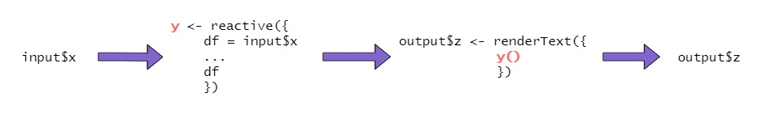

```{r, echo=FALSE, results='hide', message=FALSE, warning=FALSE}
library(dplyr)
library(ggplot2)
library(lubridate)
library(leaflet)
library(rgdal)
library(kableExtra)
library(shiny)
library(png)

# Load data
raw_data <- read.csv("data/raw_data.csv", stringsAsFactors = FALSE)
region_shp <- readOGR("data/TZ_Region_2012", "TZ_Region_2012")

# Create a colour palette
col_palette <- c("#231D51", "#178B8B", "#63C963", "#FFE31D") # 2:"#3E507F",
```

```{r setup, include=FALSE}
knitr::opts_chunk$set(echo = FALSE)
```

<style>
div.footnotes {
  position: absolute;
  bottom: 0;
  margin-bottom: 10px;
  width: 80%;
  font-size: 0.6em;
}
.bold {color: #4E23B8;}
</style>

<script src="https://ajax.googleapis.com/ajax/libs/jquery/3.1.1/jquery.min.js"></script>
<script>
$(document).ready(function() {
  $('slide:not(.backdrop):not(.title-slide)').append('<div class=\"footnotes\">');

  $('footnote').each(function(index) {
    var text  = $(this).html();
    var fnNum = (index+1).toString();
    $(this).html(fnNum.sup());

    var footnote   = fnNum + '. ' + text + '<br/>';
    var oldContent = $(this).parents('slide').children('div.footnotes').html();
    var newContent = oldContent + footnote;
    $(this).parents('slide').children('div.footnotes').html(newContent);
  });
});
</script>

<!----------------------------------------------------------------------------->
## Course Overview

- **Day 1:**
    - 1.1 Getting to know your data
    - 1.2 Data subsetting and summarising
    - 1.3 Build exploratory plots
    - <b class="bold"> 1.4 Build an interactive plot in RShiny </b>

- **Day 2:**
    - 2.1 Introduction to leaflet
    - 2.2 Building a leaflet map in R
    - 2.3 Build an interactive map in RShiny

- **Day 3:**
    - 3.1 Review
    - 3.2 Build your own apps!  

<!----------------------------------------------------------------------------->
## Build an interactive plot in RShiny  
  
A shiny app is built from multiple sections:  

- The <b>ui</b> contains code for the part of the app that the user sees.  
- The <b>server</b> contains code for the processing behind the user interface.
  
These can be contained in 1 R script, or multiple R scripts saved in the same folder. 

<!----------------------------------------------------------------------------->
## Your turn  
  
Complete section 1.4a of the handout.

<!----------------------------------------------------------------------------->
## Your turn - Results section 1.4a  
  
They are very similar, but it can be easier to seperate your code and sections using the 'multiple file' layout.  
  
All our examples and practice sections will use seperate <b>server.R</b> and <b>ui.R</b> files.

<!----------------------------------------------------------------------------->
## Inputs  
  
To make the app interactive, you need an input that the user can change.  
Shiny includes a selection of functions for this called <b>widgets</b>:  
  
``` {r, echo=FALSE}
widgets <- data.frame(Name=c("``actionButton()``", "``checkboxInput()``", "``checkboxGroupInput()``",
                             "``dateInput()``", "``dateRangeInput()``", "``numericInput()``", "``radioButtons()``",
                             "``selectInput()``", "``sliderInput()``", "``textInput()``"),
                      Description=c("a button click input", "a single checkbox",
                                    "a set of checkboxes where multiple can be selected", 
                                    "a calendar for date selection",
                                    "a pair of calendars for start and end date selection",
                                    "a free-text for numbers", "a set of buttons where only 1 can be selected",
                                    "a dropdown menu", "a slider bar", "a free-text for letters/words"))
kable_styling(kable(widgets), font_size=16)
```

<!----------------------------------------------------------------------------->
## Outputs  
  
An output is required to show the user the effects of their input.  
Shiny includes a selection of ``render*()`` and ``*Output()`` functions for this:  
  
``` {r, echo=FALSE}
outputs <- data.frame("render*()"=c("``renderImage()``", "``renderPlot()``", "``renderPrint()``",
                                    "``renderTable()``", "``DT::renderDataTable()``", "``renderText()``", 
                                    "``rendeerUI()``"),
                      "*Output()"=c("``imageOutput()``", "``plotOutput()``", "``verbatimTextOutput()``",
                                    "``tableOutput()``", "``dataTableOutput()``", 
                                    "``textOutput()``", "``uiOutput()`` or ``htmlOutput()``"))
kable_styling(kable(outputs), font_size=16)
```

<!----------------------------------------------------------------------------->
## Using inputs and outputs together  
  
``Input()`` and ``Output()`` functions are used in the <b>ui</b>.  
``render()`` functions are used in the <b>server</b>.

<b>ui</b>
```{r, echo=TRUE, eval=FALSE}
radioButtons(inputId="radio", 
             label="Choose a number:",
             choices=list("Choice 1"=1, "Choice 2"=2, "Choice 3"=3), 
             selected=1), 

verbatimTextOutput("chosen_number")
```

<b>server</b>
```{r, echo=TRUE, eval=FALSE}
output$chosen_number <- renderPrint({
  input$radio 
  })
```

<!----------------------------------------------------------------------------->
## Using inputs and outputs together  

<br>

```{r, echo=FALSE}
shinyApp(

  ui = fluidPage(
    tags$head(
    tags$style(HTML("
      #txt {font-size: 26px;}
      #txt b {font-family: 'Lucida Console', Monospace; color: #5bb662; font-size: 26px; font-weight: normal;}
    "))),
    
    HTML("<div id='txt'>Input: <b>radioButtons()</b></div>"),
    radioButtons(inputId="radio", 
                 label="Choose a number:",
                 choices=list("Choice 1"=1, "Choice 2"=2, "Choice 3"=3), 
                 selected=1), 
    
    br(),
    
    HTML("<div id='txt'>Input: <b>textOutput()</b></div>"),
    verbatimTextOutput("chosen_number")
  ),

  server = function(input, output) {
    output$chosen_number <- renderPrint({
      input$radio 
      })
  },

  options = list(height = 500)
)
```

<!----------------------------------------------------------------------------->
## Your turn  
  
Complete section 1.4b of the handout.  
  
<div style="color: #FF6666;"> Notes for linking:  
  
 - Add ``age`` to list of options  
 - apps/Day 1 - barplot_1  
</div>
  
<!----------------------------------------------------------------------------->
## Your turn - Results section 1.4b  

<!----------------------------------------------------------------------------->
## Your turn  
  
Complete section 1.4c of the handout.  
  
<div style="color: #FF6666;"> Notes for linking:  
  
 - Add a 2nd text output that summarises the input in some way e.g. head(), tail(), summary()  
 - apps/Day 1 - barplot_2
</div>
  
<!----------------------------------------------------------------------------->
## Your turn - Results section 1.4c  

<!----------------------------------------------------------------------------->
## Making your code 'reactive'  

- All code within the server must be contained within a 'reactive' element, otherwise the app will fail to run.  
  
- The previous examples take the user input and either output it directly or carry out minor processing inside the ``render()`` functions.  
  
- If we want to subset the data based on user input that can be available to multiple outputs, we need to use additional 'reactive' functions...
  
<!----------------------------------------------------------------------------->
## The ``reactive()`` function
  
- The ``reactive()`` function is used to carry out data processing in response to a user input, with the output saved as an object.  

- Any objects created in the function should but done with an ``=`` rather than the normal ``<-``.  
  
- The last line of the function should be the object you would like to be saved overall (e.g. a data subset).  

- The final object must be referenced within a ``render()`` function followed by a set of brackets in order to work.  
  
```{r, fig.align='center', out.height="120px", out.width="100%"}

 
```

<!----------------------------------------------------------------------------->
## Your turn  
  
Complete section 1.4d of the handout.  
  
<div style="color: #FF6666;"> Notes for linking:  
  
 - Change the dropdown from ``species`` to ``region``  
 - apps/Day 1 - timeseries_1  
</div>
  
<!----------------------------------------------------------------------------->
## Your turn - Results section 1.4d  

  
<!----------------------------------------------------------------------------->
## Your turn  
  
Complete section 1.4e of the handout.  
  
<div style="color: #FF6666;"> Notes for linking:  
  
 - Change the checkboxes from ``sex`` to ``species``  
 - apps/Day 1 - timeseries_2
</div>

<!----------------------------------------------------------------------------->
## Your turn - Results section 1.4e  

<!----------------------------------------------------------------------------->
## Your turn  
  
Complete section 1.4f of the handout.  
  
<div style="color: #FF6666;"> Notes for linking:  
  
 - Change from a 1-sided to a 2-sided slider <em>(remind about ?sliderInput help page)</em>  
 - apps/Day 1 - timeseries_3
</div>

<!----------------------------------------------------------------------------->
## Your turn - Results section 1.4f    
  
<!----------------------------------------------------------------------------->
## The ``reactiveValues()`` function
  

<!----------------------------------------------------------------------------->
## The ``observeEvent()`` function
  

<!----------------------------------------------------------------------------->
## Your turn  
  
Complete section 1.4g of the handout. 

<div style="color: #FF6666;"> Notes:  
  
 - Have a look at the 4th time series plot.  
 - What reactive elements have changed?  
 - Can you think of any scenarios where it would be better to use a "Go" button to trigger a reactive event?  
 - apps/Day 1 - timeseries_4
</div>

<!----------------------------------------------------------------------------->
## Your turn - Results section 1.4g    


