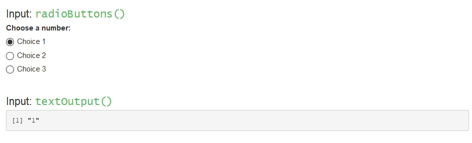

<style>
h1, h2, h3, h4 {font-weight: bold;}
.blue {color: #4E23B8;}
hr {border: 2px solid black;}
a.title:link {color: white; text-decoration: none;}
a.title:visited {color: white; text-decoration: none;}
a.title:hover {color: #c9bde9; text-decoration: none;}
a.title:active {color: white; text-decoration: none;}
a.main:link {color: #4E23B8; text-decoration: none;}
a.main:visited {color: #4E23B8; text-decoration: none;}
a.main:hover {color: #4E23B8; font-weight: bold; text-decoration: none;}
a.main:active {color: #4E23B8; text-decoration: none;}
.panel-aims {color: white; background-color: #4E23B8; border-top: 3px solid black; border-bottom: 3px solid black; padding-left: 15px; padding-right: 15px; }
.panel-section {color: black; background-color: #c9bde9; border-top: 3px solid black; border-bottom: 3px solid black; padding-left: 15px; padding-right: 15px; }
.ui-background {background-color: #fcf0cd;}
.server-background {background-color: #dfecfc;}
</style>

```{r, echo=FALSE}
library(kableExtra)
```

<!--- ---------------------------------------------------------------------- -->
<!--- Contents section -->

<br>
<div class="row"> <!--- Setup grid for layout -->
<div class="col-md-12"> <!--- Begin column set -->
<div class="panel panel-aims"> <!--- Begin panel -->
<h3>Contents</h3>
Click to view a specific section of the document.  
<br>
<ul>
<li><a class="title" href="#1">Pre-built apps</a></li>
<li><a class="title" href="#2">Important Notes</a></li>
<li><a class="title" href="#3">Inputs (Widgets)</a></li>
<li><a class="title" href="#4">Outputs</a></li>
<li><a class="title" href="#5">Using inputs & Outputs together</a></li>
<li><a class="title" href="#6">Reactive functions</a></li>
<li><a class="title" href="#7">More Information</a></li>
</ul>
</div> <!--- End panel -->
</div> <!--- End column set -->
</div> <!--- End grid -->

<!--- ---------------------------------------------------------------------- -->
<!--- 1. Pre-built apps -->

<div class="row"> <!--- Setup grid for layout -->
<div class="col-md-12"> <!--- Begin column set -->
<div class="panel panel-section"> <!--- Begin panel -->
<h3 id="1">Pre-built apps</h3>
</div> <!--- End panel -->
</div> <!--- End column set -->
</div> <!--- End grid -->

Most of the activities in this section will use a pre-built app from the Apps folder, which are all set up in a similar way: <br>

<em> server.R scripts </em>
<ul>
<li> The server script contains all reactive processing code used for the app </li>
<li> The script starts by loading in any required package libraries, data and creating a colour palette to use </li>
<li> Some scripts may also do some data processing </li>
<li> The server section is opened with ``shinyServer(function(input, output) {`` </li>
</ul>
<em> ui.R scripts </em>
<ul>
<li> The ui scripts contains all code that produces the screen that the app user will see </li>
<li> The script starts by loading in package libraries, data and often some data processing </li>
<li> The ui section is opened with ``shinyUI(fluidPage(``.  </li>
<li> The ui uses special functions to format the text, such as ``br()`` which gives a line break or ``h4()`` which sets the font size </li>
<li> There will then be some code to setup the layout with a side panel and a main panel: we use the side panel to show the widgets, and the main panel for the outputs </li>
</ul>
<br>

<!--- ---------------------------------------------------------------------- -->
<!--- 2. Important Notes -->

<div class="row"> <!--- Setup grid for layout -->
<div class="col-md-12"> <!--- Begin column set -->
<div class="panel panel-section"> <!--- Begin panel -->
<h3 id="2">Important Notes</h3>
</div> <!--- End panel -->
</div> <!--- End column set -->
</div> <!--- End grid -->

<ul>
<li> Each app must be contained in its own folder, because the scripts are named <b>server.R</b> and <b>ui.R</b> - which are not unique! </li>
<li> Any data you use in an app must be located in the same folder as the server.R and ui.R scripts that use it. We store our data in a sub-folder called "data" to keep the app folder organised. </li>
</ul>
<center></center>
<br>

<!--- ---------------------------------------------------------------------- -->
<!--- 3. Inputs (Widgets) -->

<div class="row"> <!--- Setup grid for layout -->
<div class="col-md-12"> <!--- Begin column set -->
<div class="panel panel-section"> <!--- Begin panel -->
<h3 id="3">Inputs (Widgets)</h3>
</div> <!--- End panel -->
</div> <!--- End column set -->
</div> <!--- End grid -->

input is used in the <b>ui</b> to sets the options for the user to interact with. <br><br>
``` {r, echo=FALSE}
widgets <- data.frame(Name=c("``actionButton()``", "``checkboxInput()``", "``checkboxGroupInput()``",
"``dateInput()``", "``dateRangeInput()``", "``numericInput()``", "``radioButtons()``",
"``selectInput()``", "``sliderInput()``", "``textInput()``"),
Produces=c("a button click input", "a single checkbox",
"a set of checkboxes where multiple can be selected",
"a calendar for date selection",
"a pair of calendars for start and end date selection",
"a free-text for numbers", "a set of buttons where only 1 can be selected",
"a dropdown menu", "a slider bar", "a free-text for letters/words"))
kable_styling(kable(widgets), font_size=14, full_width=FALSE, position="left", bootstrap_options=c("bordered", "condensed"))
```
<br>

<!--- ---------------------------------------------------------------------- -->
<!--- 4. Outputs -->

<div class="row"> <!--- Setup grid for layout -->
<div class="col-md-12"> <!--- Begin column set -->
<div class="panel panel-section"> <!--- Begin panel -->
<h3 id="4">Outputs</h3>
</div> <!--- End panel -->
</div> <!--- End column set -->
</div> <!--- End grid -->

render functions are used in the <b>server</b> to generate the output, and saved to an object as ``output$___``.  
output functions are used in the <b>ui</b> to display the output to the user. <br><br>
``` {r, echo=FALSE}
outputs <- data.frame("render"=c("``renderImage()``", "``renderPlot()``", "``renderPrint()``",
"``renderTable()``", "``DT::renderDataTable()``", "``renderText()``",
"``rendeerUI()``"),
"output"=c("``imageOutput()``", "``plotOutput()``", "``verbatimTextOutput()``",
"``tableOutput()``", "``dataTableOutput()``", "``textOutput()``",
"``uiOutput()`` or ``htmlOutput()``"),
"Produces"=c("an image", "a plot/map", "any printed output formatted as code",
"a table", "an interactable table", "any character string formatted to match app",
"any character string formatted with raw HTML code"))
kable_styling(kable(outputs), font_size=14, full_width=FALSE, position="left", bootstrap_options=c("bordered", "condensed"))
```
<br>

<!--- ---------------------------------------------------------------------- -->
<!--- 5. Using inputs & Outputs together -->

<div class="row"> <!--- Setup grid for layout -->
<div class="col-md-12"> <!--- Begin column set -->
<div class="panel panel-section"> <!--- Begin panel -->
<h3 id="5">Using inputs & Outputs together</h3>
</div> <!--- End panel -->
</div> <!--- End column set -->
</div> <!--- End grid -->

Inputs and Outputs are used together to make the app interactive.  
Below is example code of a simple app, with the <span class="ui-background">ui code in yellow</span>, <span class="server-background">server code in blue</span>, and a screenshot of the app.<br>

```{r, echo=TRUE, eval=FALSE, class.source="ui-background"}
shinyUI(
  # Input
  radioButtons(inputId = "radio", label = "Choose a number:", selected = 1, 
               choices = list("Choice 1" = 1, "Choice 2" = 2, "Choice 3" = 3)) 
  
  # Output
  verbatimTextOutput("chosen_number")
)
```

```{r, echo=TRUE, eval=FALSE, class.source="server-background"}
shinyServer(function(input, output) {
  # Render
  output$chosen_number <- renderPrint({
    input$radio 
  })
})
```
<br>
<center></center>
<br>
<!--- ---------------------------------------------------------------------- -->
<!--- 6. Reactive functions -->

<div class="row"> <!--- Setup grid for layout -->
<div class="col-md-12"> <!--- Begin column set -->
<div class="panel panel-section"> <!--- Begin panel -->
<h3 id="6">Reactive functions</h3>
</div> <!--- End panel -->
</div> <!--- End column set -->
</div> <!--- End grid -->

All code within the server must be contained within a reactive element, otherwise the app will fail to run.  
``render()`` functions are reactive but limited to a small amount of code.  
To process the data based on user input (e.g. filter, summarise), the code should be wrapped within a **reactive function**:  

<br>
<h4>reactive()</h4>
<ul>
<li> used to carry out processes immediately, such as subsetting and calculations</li>
<li> saves to an output that can be referenced in render functions</li>
</ul>
<em>Example:</em> 
```{r, eval=FALSE, echo=TRUE, class.source="server-background"}
data_sub <- reactive({
  data_subset = raw_data %>%
    filter(species == input$select_species)
  data_subset = head(data_subset)
  data_subset
})

output$chosen_species_info <- renderTable({ 
  data_sub()
})
```

<br>
<h4>eventReactive()</h4>
<ul>
<li> used to delay the processing by watching for a specific user input before carrying out processes</li>
<li> saves to an output that can be referenced in render functions</li>
<li> produces NULL until the user triggers the input, so will show an empty plot/table/text as default</li>
</ul>
<em>Example:</em>
```{r, eval=FALSE, echo=TRUE, class.source="server-background"}
data_subset <- eventReactive(input$go_button, {
      data_sub = raw_data %>%
        filter(species == input$select_species)
      data_sub
    })

output$chosen_species <- renderPlot({
      ggplot() + 
        geom_bar(data=data_subset(), aes(x=age)) + 
        ggtitle(unique(data_subset()$species)) 
    })
```

<br>
<h4>reactiveValues()</h4>
<ul>
<li> used to store values, vectors or dataframes that can be updated in other reactive functions (e.g. ``observeEvent()``)</li>
<li> works as a list - 'slots' can be accessed with the ``$`` sign</li>
</ul>
<em>Example - see below</em>

<br>
<h4>observeEvent()</h4>
<ul>
<li> used to delay processing by watching for a specific user input before carrying out processes</li>
<li> should be used alongside ``reactiveValues()`` to update existing values used in render functions - this allows a default plot/table/text to be shown, rather than an empty frame </li>
</ul>
```{r, eval=FALSE, echo=TRUE, class.source="server-background"}
rv <- reactiveValues(data_sub = filter(raw_data, species=="cat"))

observeEvent(input$go_button, {
      rv$data_sub = raw_data %>%
        filter(species == input$select_species)
    })]

output$chosen_species <- renderPlot({
      ggplot() + geom_bar(data = rv$data_sub, aes(x=age)) + 
        ggtitle(unique(rv$data_sub$species))
    })
```
<br>

<!--- ---------------------------------------------------------------------- -->
<!--- 7. More Information -->

<div class="row"> <!--- Setup grid for layout -->
<div class="col-md-12"> <!--- Begin column set -->
<div class="panel panel-section"> <!--- Begin panel -->
<h3 id="7">More Information</h3>
</div> <!--- End panel -->
</div> <!--- End column set -->
</div> <!--- End grid -->

For more information on shiny, there is a <em>cheat-sheet</em> available <a class="main"  href="https://shiny.rstudio.com/images/shiny-cheatsheet.pdf" target="_blank">here</a>
<br><br>