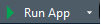

<style>
h1, h2, h3, h4 {font-weight: bold;}
.blue {color: #4E23B8;}
hr {border: 2px solid black;}
a.title:link {color: white; text-decoration: none;}
a.title:visited {color: white; text-decoration: none;}
a.title:hover {color: #c9bde9; text-decoration: none;}
a.title:active {color: white; text-decoration: none;}
a.main:link {color: #4E23B8; text-decoration: none;}
a.main:visited {color: #4E23B8; text-decoration: none;}
a.main:hover {color: #4E23B8; font-weight: bold; text-decoration: none;}
a.main:active {color: #4E23B8; text-decoration: none;}
.panel-aims {color: white; background-color: #4E23B8; border-top: 3px solid black; border-bottom: 3px solid black; padding-left: 15px; padding-right: 15px; } 
.panel-section {color: black; background-color: #c9bde9; border-top: 3px solid black; border-bottom: 3px solid black; padding-left: 15px; padding-right: 15px; } 

<!--- Collapse button --->
input {display: none; visibility: hidden;}
label { display: block; padding: 0.5em; text-align: center; border-bottom: 1px solid #CCC; color: #666;}
label:hover {color: #000;}
label::before {font-weight: bold; font-size: 15px; content: "+"; vertical-align: text-top; display: inline-block;  width: 20px; height: 20px; margin-right: 3px; background: radial-gradient(ellipse at center, #CCC 50%, transparent 50%);}
.expand {height: 0px; overflow: hidden; transition: height 0.5s; color: #FFF;}
section {padding: 0 20px;}
.toggle:checked ~ .expand {height: 250px;}
.toggle:checked ~ label::before {content: "-";}
</style>

```{r, echo=FALSE}
library(kableExtra)
```

<!--- ---------------------------------------------------------------------- -->
<!--- Contents section -->

<br>
<div class="row"> <!--- Setup grid for layout -->
<div class="col-md-12"> <!--- Begin column set -->
<div class="panel panel-aims"> <!--- Begin panel -->
<h3>Contents</h3>
Click to view a specific section of the document.  
<br>
<ul>
<li><a class="title" href="#1.4a">1.4a Create a shiny app</a></li>
<li><a class="title" href="#1.4b">1.4b Add an option to a radio button widget</a></li>
<li><a class="title" href="#1.4c">1.4c Add a new text output</a></li>
<li><a class="title" href="#1.4d">1.4d Make a simple change to the data used by a widget</a></li>
<li><a class="title" href="#1.4e">1.4e Make a more complicated change to the data used by a widget </a></li>
<li><a class="title" href="#1.4f">1.4f Change a widget</a></li>
<li><a class="title" href="#1.4g">1.4g Explore a "Go" button</a></li>
</ul>
</div> <!--- End panel -->
</div> <!--- End column set -->
</div> <!--- End grid -->

<!--- ---------------------------------------------------------------------- -->
<!--- 1.4a. Create a shiny app -->

<div class="row"> <!--- Setup grid for layout -->
<div class="col-md-12"> <!--- Begin column set -->
<div class="panel panel-section"> <!--- Begin panel -->
<h3 id="1.4a">1.4a &nbsp; Create a shiny app</h3>
</div> <!--- End panel -->
</div> <!--- End column set -->
</div> <!--- End grid -->

<h4 class="blue">Goal: Create an app in a single R script</h4>
<ol>
<li> Open up R Studio </li>
<li> On the top menu, click on:  </li>
&nbsp;&nbsp; File > New File > Shiny Web App  
<li> Type in a name for your app, click on <em>Single File (app.R)</em>, check you are happy with the directory, then click Create! </li> 
<li> Click on the  button to run the code and load the app </li>
</ol> 
<br>
<h4 class="blue">Goal: Create an app using multiple R scripts</h4>
<ol>
<li> On the top menu, click on:  </li>
&nbsp;&nbsp; File > New File > Shiny Web App  
<li> Type in a name for your app, click on <em>Multiple File (ui.R/server.R)</em>, check you are happy with the directory, then click Create! </li> 
<li> Run the app as before </li>
</ol>
<br>

<!--- ---------------------------------------------------------------------- -->
<!--- 1.4b. Add an option to a radio button widget -->

<div class="row"> <!--- Setup grid for layout -->
<div class="col-md-12"> <!--- Begin column set -->
<div class="panel panel-section"> <!--- Begin panel -->
<h3 id="1.4b">1.4b &nbsp; Add an option to a radio button widget</h3>
</div> <!--- End panel -->
</div> <!--- End column set -->
</div> <!--- End grid -->

Please navigate to the <b class="blue">Apps/barplot_1</b> folder and open up the <b class="blue">ui.R</b> and <b class="blue">server.R</b> scripts in R Studio.
<br><br>
This is a simple app that uses our dataset to show a barplot.
<br>
There is only 1 widget - ``selectInput()`` - to show a Dropdown menu that selects a variable to show on the x-axis.
<br><br>
Please take a moment to have a look at the server and ui scripts, then run the app.
<br><br>
<h4 class="blue">Goal: Add age as an option  to view on the x-axis</h4>
<br>
<em>
Hints:
<ul>
<li>Remember to explore the dataset to find the correct column name</li>
<li>You only need to change the ui file</li>
</ul>
</em>
<br>

<!--- ---------------------------------------------------------------------- -->
<!--- 1.4c. Add a new text output -->

<div class="row"> <!--- Setup grid for layout -->
<div class="col-md-12"> <!--- Begin column set -->
<div class="panel panel-section"> <!--- Begin panel -->
<h3 id="1.4c">1.4c &nbsp; Add a new text output</h3>
</div> <!--- End panel -->
</div> <!--- End column set -->
</div> <!--- End grid -->

Please navigate to the <b class="blue">Apps/barplot_2</b> folder and open up the <b class="blue">ui.R</b> and <b class="blue">server.R</b> scripts in R Studio.
<br><br>
This is the same simple barplot app as before, but with a new ``verbatimtextOutput()`` below.
<br>
<em>Verbatim</em> simply mean as is - it prints the output to look like ``code``.
<br><br>
Please take a moment to have a look at the server and ui scripts, then run the app.
<br><br>
<h4 class="blue">Goal: Add another text output </h4>
<br>
<em>
Hints:
<ul>
<li>You could show a summary of your data e.g. ``head()``, ``summary()``</li>
<li>You will need to change both files</li>
</ul>
</em>
<br>

<!--- ---------------------------------------------------------------------- -->
<!--- 1.4d. Make a simple change to the data used by a widget -->

<div class="row"> <!--- Setup grid for layout -->
<div class="col-md-12"> <!--- Begin column set -->
<div class="panel panel-section"> <!--- Begin panel -->
<h3 id="1.4d">1.4d &nbsp; Make a simple change to the data used by a widget</h3>
</div> <!--- End panel -->
</div> <!--- End column set -->
</div> <!--- End grid -->

<!--- ---------------------------------------------------------------------- -->
<!--- 1.4e. Make a more complicated change to the data used by a widget -->

<div class="row"> <!--- Setup grid for layout -->
<div class="col-md-12"> <!--- Begin column set -->
<div class="panel panel-section"> <!--- Begin panel -->
<h3 id="1.4e">1.4e &nbsp; Make a more complicated change to the data used by a widget</h3>
</div> <!--- End panel -->
</div> <!--- End column set -->
</div> <!--- End grid -->

<!--- ---------------------------------------------------------------------- -->
<!--- 1.4f. Change a widget -->

<div class="row"> <!--- Setup grid for layout -->
<div class="col-md-12"> <!--- Begin column set -->
<div class="panel panel-section"> <!--- Begin panel -->
<h3 id="1.4f">1.4f &nbsp; Change a widget</h3>
</div> <!--- End panel -->
</div> <!--- End column set -->
</div> <!--- End grid -->

<!--- ---------------------------------------------------------------------- -->
<!--- 1.4ag Explore a "Go" button -->

<div class="row"> <!--- Setup grid for layout -->
<div class="col-md-12"> <!--- Begin column set -->
<div class="panel panel-section"> <!--- Begin panel -->
<h3 id="1.4g">1.4g &nbsp; Explore a "Go" button</h3>
</div> <!--- End panel -->
</div> <!--- End column set -->
</div> <!--- End grid -->